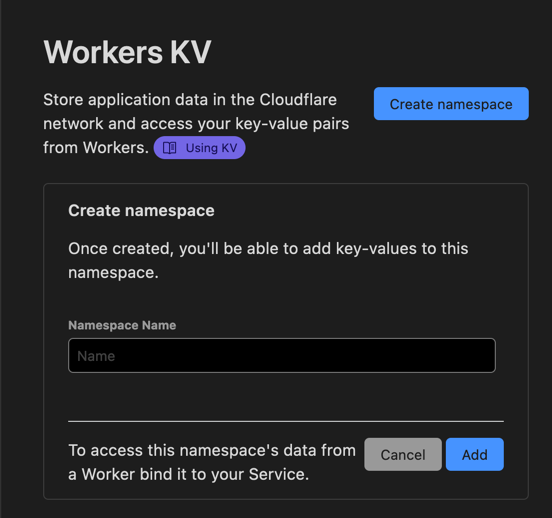

# Uni-Clipboard API

Universal Clipboard API service on [Cloudflare Workers](https://workers.cloudflare.com/).

- Create own clipboard API service
- Simple GET/POST API
- Delete data automatically. Default: 60 seconds

## Setup

### 1. Fork and Deploy to Cloudflare Workers

[](https://deploy.workers.cloudflare.com/?url=https://github.com/azu/uni-clipboard)

## 2. Bind `UNI_CLIPBOARD` to KV namespaces

On Web:

1. Create Worker KV namespace from `https://dash.cloudflare.com/{yourid}/workers/kv/namespaces`
    - 
2. Bind Created KV to `UNI_CLIPBOARD` from `https://dash.cloudflare.com/{yourid}/workers/services/view/uni-clipboard/production/settings/bindings`
   - 

On Local:

```shell
npx wrangler kv:namespace create "UNI_CLIPBOARD"
```

### 3. Put `UNI_TOKEN` for your access token

On Web:

1. Input your access token to `UNI_TOKEN`
   - 

On Local:

```shell
$ npx wrangler secret put UNI_TOKEN
XXX
```

## Usage

Get clipboard

```js
await fetch('https://uni-clipboard.{your}.workers.dev/?token=XXX')
```

Update clipboard

```js
await fetch("https://uni-clipboard.{your}.workers.dev/?token=XXX", { method: "post", body: "New Content"})
```

Redirect to clipboard

```
https://uni-clipboard.{your}.workers.dev/?token=XXX&redirect=1
```

## Client

You can use [Shortcuts](https://apps.apple.com/us/app/shortcuts/id915249334) and [Alfred](https://www.alfredapp.com/) as client.


For example, Alfred allow you to use ShellScript.

Push your clipboard to uni-clipboard.

```shell
c=$(pbpaste | /usr/local/bin/jq -aRs .)
curl -X POST -H "Content-Type: application/json" -d "{\"value\":${c}}" \
"https://uni-clipboard.{you}.workers.dev/?token={token}"
```

Read clipboard text from uni-clipboard

```shll
curl "https://uni-clipboard.{you}.workers.dev/?token={token}" | pbocpy
```

## Development

    wranger dev

## Deploy

    wranger publish

## Contributing

1. Fork it!
2. Create your feature branch: `git checkout -b my-new-feature`
3. Commit your changes: `git commit -am 'Add some feature'`
4. Push to the branch: `git push origin my-new-feature`
5. Submit a pull request :D

## License

MIT
